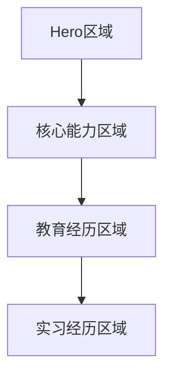

## 1. Product Overview

鲍晗个人网站是一个展示AI产品经理专业背景和核心能力的单页滚动式网站。通过极简的黑色科技风格设计，突出个人专业形象，展示在大模型产品化、Agent设计、数据分析等核心能力领域的专业经验。

目标用户：潜在雇主、合作伙伴、行业同行，用于了解鲍晗的专业背景和核心能力。

## 2. Core Features

### 2.1 User Roles

| Role | Registration Method | Core Permissions |
|------|---------------------|------------------|
| Visitor | No registration required | Browse all content, view animations and interactions |

### 2.2 Feature Module

网站采用单页滚动结构，包含以下核心模块：
1. **Hero区域**：个人姓名、职位、专业标语展示
2. **核心能力区域**：四个能力卡片的网格布局
3. **教育经历区域**：学历信息的时间线展示
4. **实习经历区域**：中轴线时间轴设计的工作经验展示

### 2.3 Page Details

| Page Name | Module Name | Feature description |
|-----------|-------------|---------------------|
| 单页网站 | Hero区域 | 居中显示姓名"鲍晗"、职位"AI产品经理"、标语"将大模型能力转化为可规模化业务价值"，底部包含向下滚动箭头动画 |
| 单页网站 | 核心能力区域 | 显示标题"核心能力"，四个卡片网格布局展示Agent设计、模型评估、数据分析、Vibe Coding四个核心能力，卡片支持hover发光效果 |
| 单页网站 | 教育经历区域 | 显示标题"教育经历"，墨尔本大学和澳门科技大学学历信息，时间右对齐排版 |
| 单页网站 | 实习经历区域 | 显示标题"实习经历"，中轴线时间轴设计，左右交错展示字节跳动、百度、作业帮三段实习经历，使用紫色/蓝色科技光点作为时间节点 |

## 3. Core Process

用户访问流程：
1. 用户进入网站首页，首先看到Hero区域的个人介绍
2. 向下滚动浏览核心能力区域的四个专业能力卡片
3. 继续滚动查看教育背景信息
4. 最后浏览实习经历时间轴
5. 整个过程中体验平滑滚动和渐入动画效果

## 4. User Interface Design

### 4.1 Design Style
- **主色调**：纯黑色(#000000)背景
- **辅助色**：深灰色(#1a1a1a)用于卡片背景，紫色/蓝色(#6366f1/#3b82f6)用于光效和节点
- **字体**：现代无衬线字体，类似Inter或思源黑体，标题使用较大字号(32-48px)，正文使用适中字号(16-18px)
- **按钮样式**：极简设计，hover时有微弱发光效果
- **布局风格**：居中排版，大量留白，卡片式内容组织
- **图标风格**：使用简洁的线条图标或几何图形

### 4.2 Page Design Overview

| Page Name | Module Name | UI Elements |
|-----------|-------------|-------------|
| Hero区域 | 个人信息展示 | 黑色渐变背景，白色文字居中显示，字体大小48px(姓名)/24px(职位)/18px(标语)，底部向下箭头动画使用CSS动画实现 |
| 核心能力区域 | 能力卡片网格 | 4x1网格布局，卡片背景#1a1a1a，边框1px solid #333，hover时box-shadow发光效果，标题20px加粗，描述16px正常字重 |
| 教育经历区域 | 学历信息列表 | 时间右对齐布局，学校名称20px加粗，专业和时间16px正常字重，使用细线分隔 |
| 实习经历区域 | 时间轴设计 | 中轴线2px solid #6366f1，节点使用圆形元素填充#6366f1，左右交错布局，公司名18px加粗，职位16px，描述点列表14px |

### 4.3 Responsiveness
- 采用桌面优先设计策略
- 移动端适配：核心能力区域在移动端变为2x2或1x4布局
- 时间轴在移动端变为单列布局
- 字体大小适当缩小，保持可读性
- 触摸交互优化，确保hover效果在触摸设备上的替代方案