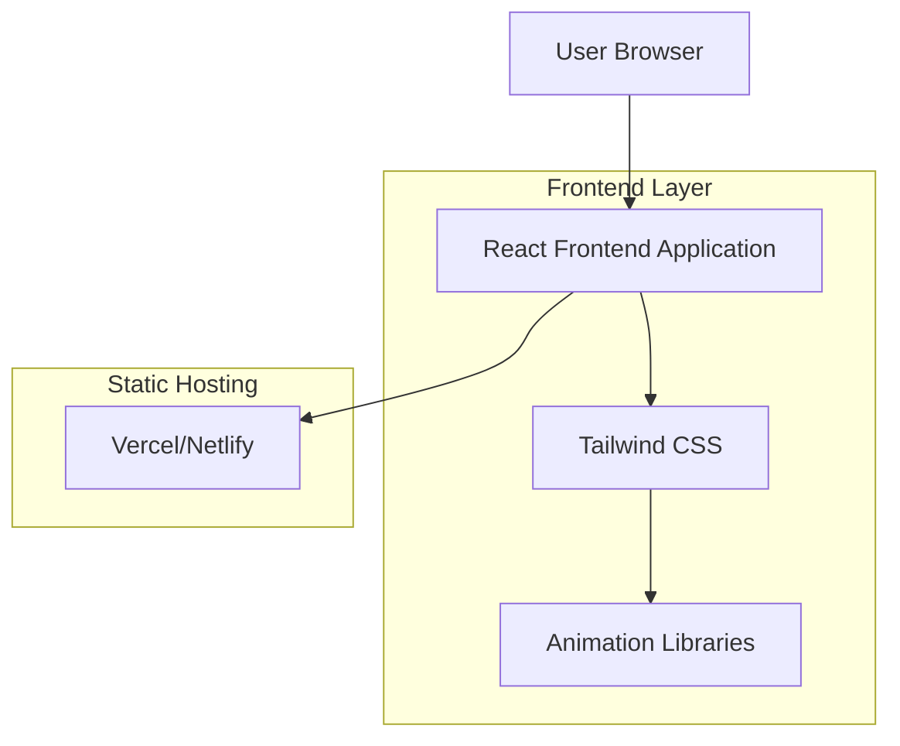

## 1. Architecture design



## 2. Technology Description

- Frontend: React@18 + Tailwind CSS@3 + Vite
- Initialization Tool: vite-init
- Animation: Framer Motion (轻量级动画库)
- Icons: Lucide React (简洁线条图标)
- Backend: None (纯静态网站)
- Deployment: Vercel (推荐) 或 Netlify

## 3. Route definitions

| Route | Purpose |
|-------|---------|
| / | 单页网站首页，包含所有内容模块 |

## 4. Component Architecture

### 4.1 主要组件结构
```
src/
├── components/
│   ├── Hero.tsx              # Hero区域组件
│   ├── CoreCapabilities.tsx  # 核心能力卡片组件
│   ├── Education.tsx         # 教育经历组件
│   ├── Experience.tsx        # 实习经历时间轴组件
│   └── common/
│       ├── Card.tsx          # 通用卡片组件
│       └── Timeline.tsx      # 时间轴组件
├── hooks/
│   └── useScrollAnimation.ts  # 滚动动画钩子
├── styles/
│   └── globals.css           # 全局样式和动画
└── App.tsx                   # 主应用组件
```

### 4.2 核心数据结构

```typescript
// 核心能力数据类型
interface Capability {
  id: string;
  title: string;
  description: string;
  icon: string;
}

// 教育经历数据类型
interface Education {
  id: string;
  school: string;
  degree: string;
  period: string;
}

// 实习经历数据类型
interface Experience {
  id: string;
  company: string;
  position: string;
  period: string;
  responsibilities: string[];
}
```

## 5. Performance Optimization

### 5.1 性能优化策略
- 使用React.lazy进行组件懒加载
- 图片资源使用WebP格式
- 启用Vite的代码分割功能
- 使用Intersection Observer实现滚动动画的性能优化

### 5.2 构建配置
```javascript
// vite.config.ts
export default defineConfig({
  plugins: [react()],
  build: {
    rollupOptions: {
      output: {
        manualChunks: {
          'framer-motion': ['framer-motion'],
          'lucide-react': ['lucide-react']
        }
      }
    }
  }
})
```

## 6. Deployment Configuration

### 6.1 Vercel部署配置
```json
{
  "buildCommand": "npm run build",
  "outputDirectory": "dist",
  "installCommand": "npm install",
  "framework": "vite"
}
```

### 6.2 环境变量
- 无需环境变量配置（纯静态网站）
- 所有内容硬编码在组件中
- 如需内容管理，可考虑集成Headless CMS